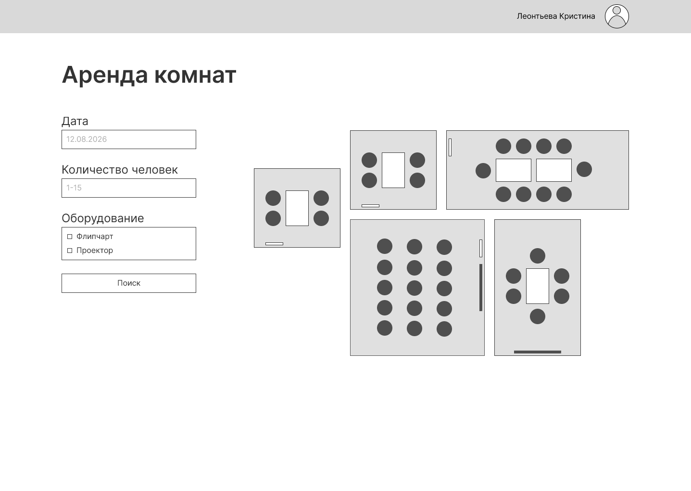
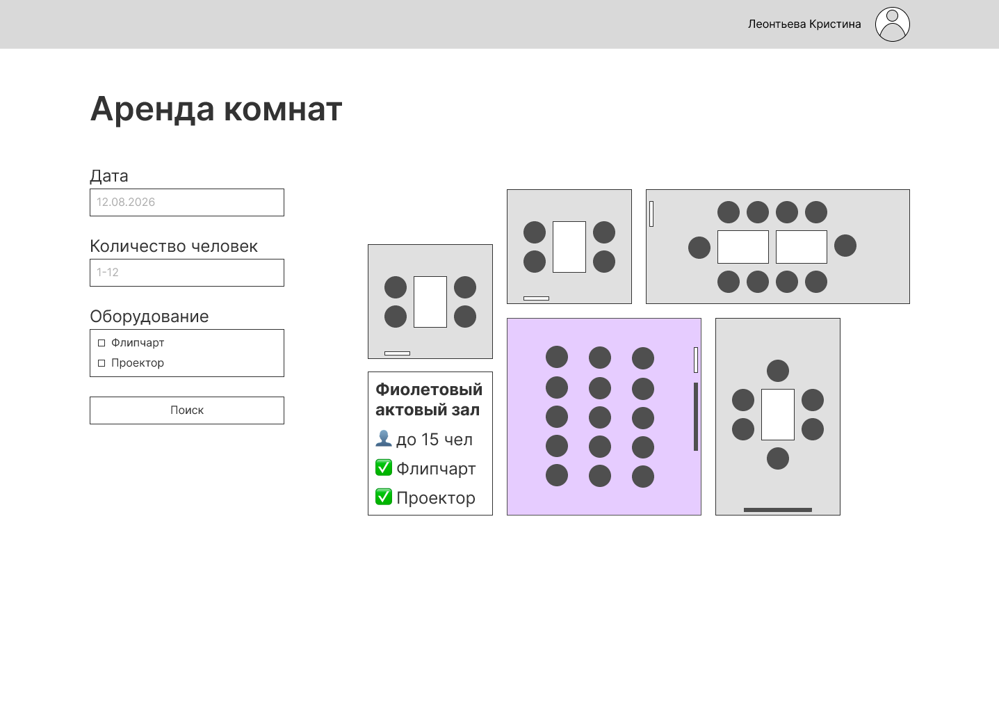
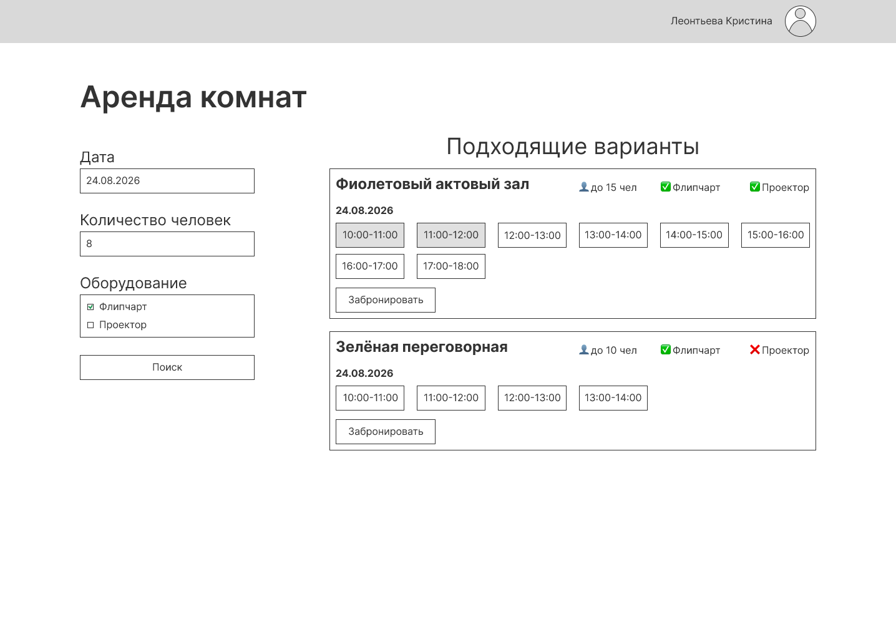
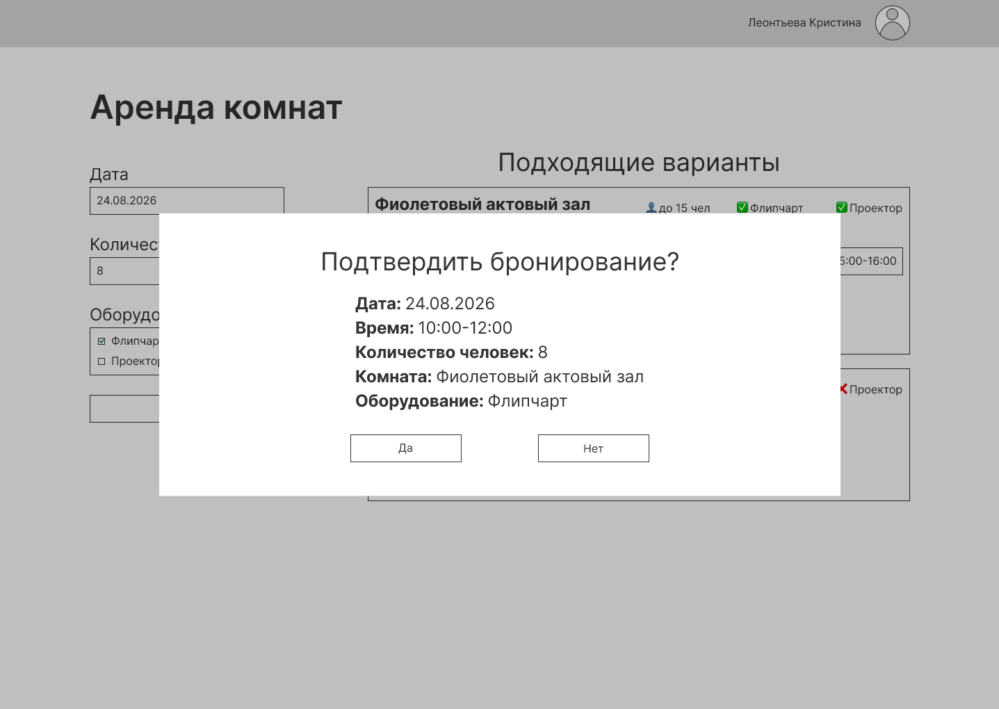
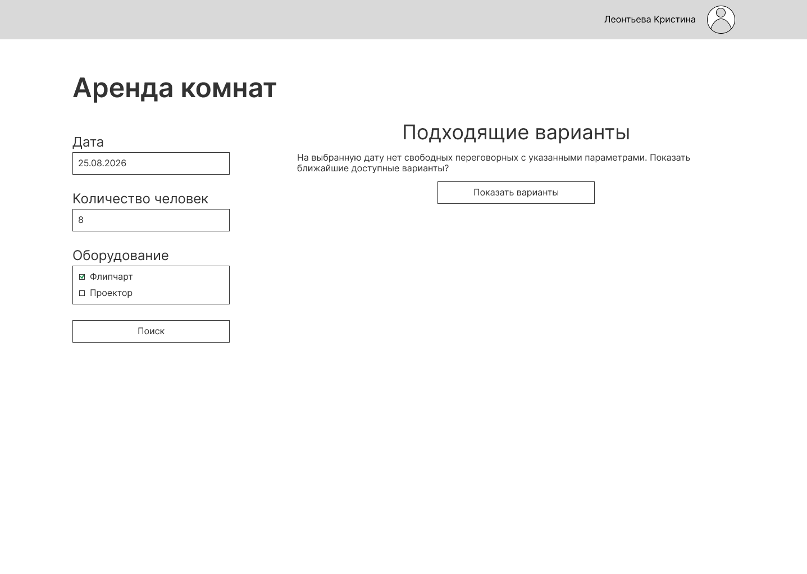
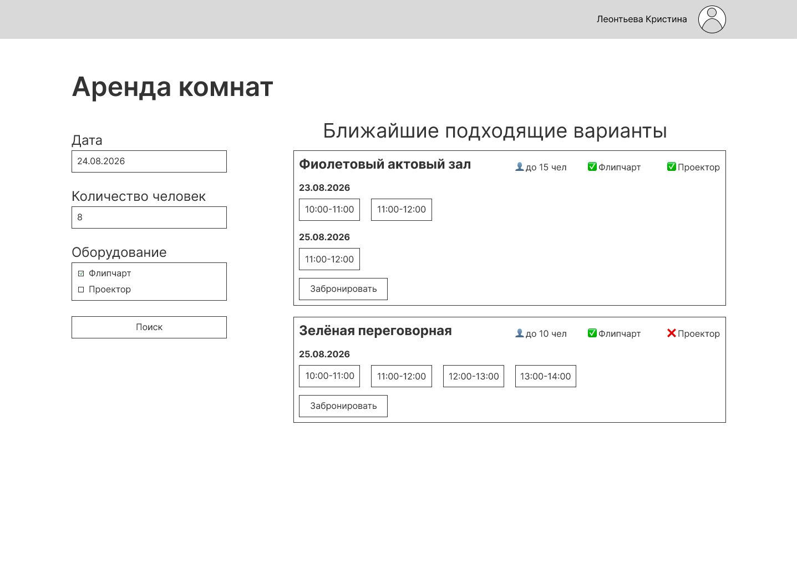

# Прототип

Прототип демонстрирует основной пользовательский сценарий поиска и бронирования переговорной комнаты.

## 1. Форма поиска

Пользователь открывает сервис «Аренда комнат». Слева отображается форма поиска с полями: дата, количество участников и необходимое оборудование. Справа отображается схема расположения переговорных комнат.

## 2. Информация о комнате

При наведении или нажатии на переговорную комнату отображается информация о ней: название, максимальная вместимость и доступное оборудование.

## 3. Результаты поиска

После ввода параметров и нажатия кнопки «Поиск» система отображает подходящие переговорные комнаты и свободные часовые интервалы для каждой комнаты.

Пользователь может выбрать один или несколько последовательных свободных интервалов одной комнаты.

## 4. Подтверждение бронирования

После выбора временного интервала и нажатия кнопки «Забронировать» система отображает окно подтверждения с параметрами бронирования.

## 5. Отсутствие подходящих вариантов

Если на выбранную дату свободные комнаты с указанными параметрами отсутствуют, система сообщает об этом пользователю и предлагает выполнить поиск ближайших вариантов.

## 6. Поиск ближайших вариантов

После нажатия кнопки «Показать варианты» система выполняет поиск на ближайшие даты с сохранением количества участников и требований к оборудованию.

Если исходная дата является будущей, поиск выполняется на один день до и один день после выбранной даты. Если выбрана текущая дата, поиск выполняется только на следующий день.

Система отображает найденные комнаты, дату и свободные часовые интервалы.

